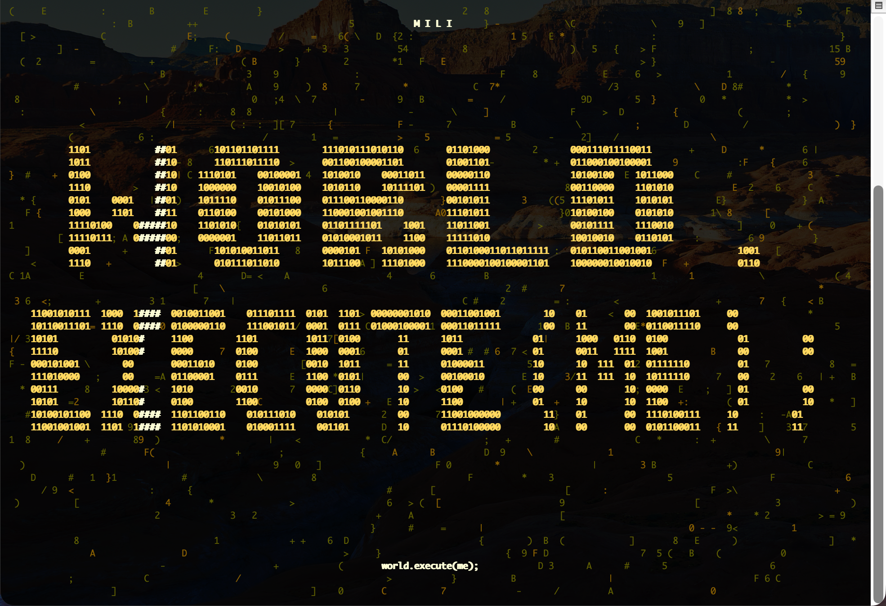

# world.execute(me); —ascii （Windows 版）



Mili《world.execute(me);》的**终端字符动画 MV**：Python 标准库把逐帧编排的画面画成 ANSI
字符，音频由系统媒体引擎驱动时间轴，中英字幕与频谱条跟着音频走。在 Windows 上双击即可播放。

---

## 改编自哪里

| | |
| --- | --- |
| 上游项目 | **yym8224961/world.execute-me-ascii** — <https://github.com/yym8224961/world.execute-me-ascii> |
| 移植基线 | 上游 commit `9d8e815281a104ccb648ec2f2df88cd9f0cb8c12`（本仓库的父提交） |
| 本副本 | 就地改造为 **仅 Windows**；macOS 那条路不保留，相关源码与脚本已删除 |
| 原曲与歌词 | Mili《world.execute(me);》，版权归原作者；本项目不授予任何额外许可 |
| 音频 | 仓库**不含**音频。首次运行时从上游 Release v1.0.0 的 `world-execute-mv.pyz` 里解出作者内嵌的那一份 `media/song.mp3`（见"音频从哪来"） |

画面、字幕、频谱数据与上游**逐帧等价**（`tests/test_win_render.py` 拿钉死的上游源码做对照，
426 帧 × 两种序列化共 852 次比较全部逐字节相同）。改了什么、为什么改、哪些假设被推翻，
逐轮记在 [docs/windows-log.md](docs/windows-log.md)。

## 快速开始

**双击 `播放MV.cmd`** → 自动打开全屏 Windows Terminal → 出现片头后**按空格**开始。

想保留底部任务栏就双击 **`播放MV_窗口.cmd`**（最大化窗口，仍带标题栏与标签栏）。

首次运行会多做一件事：下载官方发布包并**三段校验**后才把音频落盘（约 9.2 MB 下载，
几秒钟）。之后离线也能播。

命令行方式：

```bat
C:\Python314\python.exe player.py
C:\Python314\python.exe player.py --start 158.7 --autoplay
```

环境要求：Windows 10/11 + Python 3.9 以上（本机为 3.14.4）+ Windows Terminal。
不需要 pip 安装任何东西，不需要管理员权限。若你的 Python 不在 `C:\Python314\`，
改 `win\launch.cmd` 里的 `PY=` 一行。

## 键位

| 键 | 作用 | | 键 | 作用 |
| --- | --- | --- | --- | --- |
| 空格 / 回车 | 开始 / 暂停 | | `[` / `]` | 字幕提前 / 延后 0.1 秒 |
| ← / → | 后退 / 前进 5 秒 | | `,` / `.` | 上一句 / 下一句 |
| R | 从头播放 | | `+` / `-` | 音量 |
| 1 – 5 | 跳五章：创建 / 献出自我 / 离开 / 失控 / 困于爱 | | H | 帮助 |
| Q / Esc | 退出 | | | |

播放中 `Alt+Enter` 在"全屏 ↔ 窗口"之间切换（Windows Terminal 自带），
`Ctrl+Shift+加号/减号` 调字号换更多行。画面至少 **65 列 × 24 行**
（最后一列留给防自动换行，64 列会显示提示画面——这条是上游行为）；本机全屏实测 179 × 56。

## 三种窗口形态

判断逻辑都在 `win\launch.py`（不放进批处理，因为 cmd 在括号块里解析期就展开
`%ERRORLEVEL%`，且引号/分号规则容易出事）。

| 用法 | 形态 | 本机实测客户区 |
| --- | --- | --- |
| `播放MV.cmd` | 全屏，盖住任务栏 | `[0,0,2560,1600]` |
| `播放MV_窗口.cmd` | 最大化，**任务栏可见** | `[0,0,2560,1528]` ＝ 桌面工作区 |
| `win\launch.cmd win` | 普通可拖动窗口 | `[65,76,1397,1012]`，`IsZoomed=False` |

## 音频从哪来（以及为什么必须是它）

`spectrum.json` 是照着**某一个具体录音**逐帧采样的，字幕时间轴也对齐它，换音源就会错位。
上游仓库不提交音频（`.gitignore` 里有 `/media/`），音频只内嵌在 Release 播放包里。
所以 `win\get_song.py` 做三段**都必须真跑**的校验，全过才落盘：

1. 下载的 `world-execute-mv.pyz`（9,205,195 字节）必须匹配作者公布的 `SHA256SUMS.txt`
   （`55043652a24c…`）。**取不到这条就直接失败**，不退化成"只信包内清单"。
2. 解出的 `media/song.mp3`（8,620,427 字节）必须匹配包内 `bundle-manifest.json` 的
   SHA-256（`2da5fb306fc8…`）。
3. 用**播放器同一套媒体引擎**读它的时长，必须与 `config.json` 的 211.906667 相差 ≤ 0.5 秒
   （实测引擎报 211.98365，差 0.077 秒）。

第 3 段以前用的是 MCI，而本机 MCI 打不开 MP3，那一腿当时是死的——现在换成活的。
校验通过的包留在 `.build/cache/` 并配 `.verified` 摘要，第二次运行走缓存但仍要与当期公布值一致。
想强制重取：`python win\get_song.py --force`。

## 目录结构

```
player.py            播放器主体：字符画、字幕、频谱、帧循环、键位分发
scenes.py            逐帧编排（纯 math，零平台调用，与上游一致）
lyrics.json          中英字幕时间轴（UTF-8，129 条）
spectrum.json        逐帧频谱数据
config.json          音频路径、时长、字幕偏移、（可选）宽字形名单
播放MV.cmd           双击入口：全屏
播放MV_窗口.cmd       双击入口：最大化窗口（留任务栏）
win\audioclock.ps1   Windows 音频时钟（WinRT Media Foundation），说与上游 Swift 版相同的行协议
win\winconsole.py    控制台 VT 模式、尺寸、按键线程、高精度定时器
win\get_song.py      取音频并做三段校验
win\launch.py        启动决策（三档窗口、缺音频时自动取）
win\calibrate.py     实测终端给每个字形画了几格（像素法）
win\screenctl.py     GDI 抓屏，供 calibrate 使用
tests\test_win_audio.py   音频时钟契约 21 项
tests\test_win_render.py  与上游逐帧等价 9 项
docs\windows-log.md  逐轮记录：实测数字、判据替换、被推翻的假设
docs\win-glyph-metrics.json  字形占格的机器可读测量结果
双语歌词.lrc / 双语字幕.srt   给人用的歌词与字幕，程序不读取
```

## 排障

```bat
player.py --backend none             :: 不出声，只放画面（此档不需要 media/song.mp3）
player.py --snapshot 159.85 --plain  :: 不开终端也能看某一帧
player.py --report f.json --start 60 --stop-after 68 --autoplay
```

`--report` 会记下帧数、真实窗口尺寸、**尺寸是谁报的**、最坏一帧耗时、音频就绪秒数、
本次对控制台模式做了什么改动、以及生效的宽字形名单——出问题先跑一遍看这份文件。

| 现象 | 判断 |
| --- | --- |
| 提示"当前终端宿主是 console/vscode…" | 不在 Windows Terminal 里跑。备用屏与光标显隐在别的宿主上还原得不一样，改用双击入口 |
| 画面只占左上角一小块 | 终端窗口小于 65×24，程序主动画的提示画面 |
| 按空格没声音 | 看是否报 `音频引擎报错：…`；没报错就去系统音量里看这个应用的会话音量（`+/-` 调的是播放器内部音量，不动系统音量） |
| 关掉后留一个全屏黑窗 | 正常收尾（退出码 0）会自动关标签页；`taskkill` 或播放报错（码 1）时窗口留着，是为了让 `播放失败：…` 能被看见 |
| 首行崩溃 `UnicodeDecodeError` | 有人把 `read_text()` 的 `encoding='utf-8'` 改回去了：中文 Windows 默认 cp936，读不了 UTF-8 中文字幕 |

## 本机实测到的数

| 项 | 值 |
| --- | --- |
| 音频时钟发报频率 | 64 Hz（PowerShell 睡眠落在 15.6 ms 刻度，请求 90 Hz 即一个刻度） |
| 时长读数 | 引擎 211.98365 s ／ 配置 211.906667 s，差 0.077 s |
| 暂停 / seek | 暂停时位置逐位冻结；暂停态 `seek 158.7` 回读 158.700000 且不自行起播 |
| 音频就绪 | 2.45 s（冷启动 2.95 s）——这段时间画面还没开始画 |
| 10 秒实播 | 244 帧 / 24.32 fps / 最坏一帧 18.8 ms（预算 41.7 ms）/ 窗口 179×56 |
| 字形占格 | 34 个 East-Asian-Ambiguous 字形全部 1.0 格；控制组汉字 1.98 格；cell 14.2927 px |
| 听觉与画面 | 用户实听确认有声并验收画面 |

## 重跑验证

```bat
C:\Python314\python.exe tests\test_win_audio.py      :: 21 项，缺音频会红而不是静默跳过
C:\Python314\python.exe tests\test_win_render.py     :: 9 项，与上游逐帧等价
wt.exe --fullscreen -d . C:\Python314\python.exe win\calibrate.py   :: 字形占格实测
```

`test_win_render.py` 的对照物钉在 commit `9d8e815`（SHA-256 `aac5c7b48f663013…`）的上游
`player.py`，只补两处让它能在 Windows 上 import（去掉 `termios` 导入、给 `read_text()`
加编码），改动量被断言为"恰好 8 行差异"，多一处就红；对照物缺失时自行从 git 取回并按摘要复核。
**提交本仓库之后它仍读那个固定 commit**，不会退化成"拿我的文件跟我的文件比"。

`win\calibrate.py` 会**覆写** `docs/win-glyph-metrics.json`，并把测量那一屏存成
`.build/calibrate-screen.png` 作为证据（`.build/` 不入库）。

## 已知边界

- **MCI 不能放 MP3**：本机 `MPEGVideo` 驱动注册为 `mciqtz32.dll`（QuickTime 包装器），
  未装 QuickTime，`mciSendStringW` 打开 MP3 恒返回 err 277。所以播放与时长校验都走
  Media Foundation。
- **Windows Terminal 不回答 `ESC[6n`**（三种读法实测都收不到），所以字形占格只能用像素法测。
- **DPI 不感知的抓屏是左上裁片**：`calibrate.py` 会先声明 DPI 感知，否则量到的是屏幕左上
  一块而不是整屏。
- **中文 Windows 默认编码 cp936**：所有文本读写都显式 `encoding='utf-8'`；控制台输出走
  `WriteConsoleW`，与代码页无关，因此**不要** `chcp 65001`、不要重开 `CONOUT$`。
- **目录名含 `;` `(` `)` 空格与 em-dash**：启动器一律用 `wt -d .` 相对路径，不把仓库绝对路径
  拼进命令行（`wt` 用 `;` 分隔自己的参数）。本机 F 盘也拿不到 8.3 短名。
- **未验证**：N 版 Windows（无媒体组件）的 MP3 解码路径；legacy conhost 下的实际观感。
- **未做**：单文件 `.pyz` 的 Windows 包（`.pyz` 在 Windows 没有双击关联，收益低）；
  冷启动那 2.5 秒无画面（要消掉得解耦"等时长"与"画首帧"，属于改结构）。

## 与原 macOS 版的差异

保留了行协议与全部画面逻辑；换掉的是三处平台绑定：音频时钟（AVFoundation → Media
Foundation）、终端输入（`termios`/`tty`/`select` → 控制台 API + `msvcrt` 工作线程）、
尺寸与模式（`/dev/tty` → `GetConsoleScreenBufferInfo` + `SetConsoleMode`）。
`AudioClock.swift`、`run.sh`、`build-audio.sh`、`播放MV.command`、`运行单文件.command`
与 `tools/` 打包脚本已删除，历史在 `git log`。

## 版权

原曲《world.execute(me);》与歌词版权归 Mili / 原权利方所有。本仓库是个人学习与备份用途的
改编，不发布音频、不对任何第三方素材授予额外许可。音频仅存在于你本机的 `media/` 与
上游 Release 包内，且被 `.gitignore` 明确挡在版本库之外。
